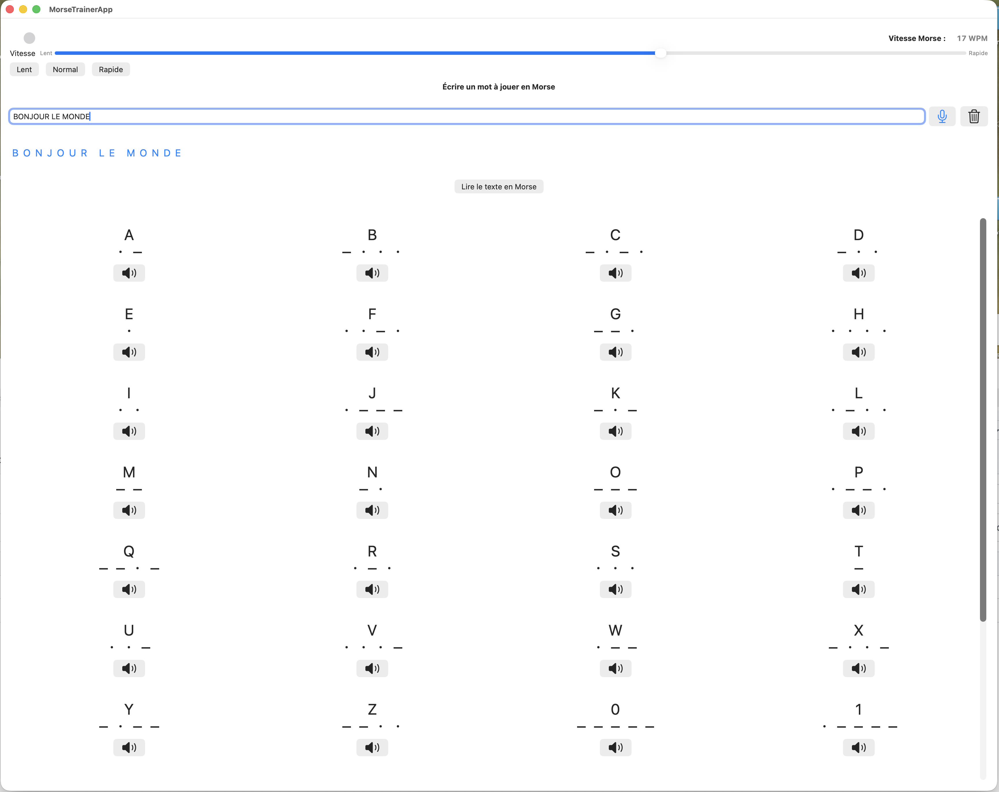

# 🔊 Morse Player

## 🧭 Présentation

**Morse Player** est une application macOS écrite en **SwiftUI** qui permet de :
- ✍️ Écrire un texte et le **jouer en code Morse** sonore ;
- 🎙️ Utiliser la **reconnaissance vocale** pour générer automatiquement le texte à jouer ;
- 🎚️ **Régler la vitesse de lecture** (0.06 à 0.09 s par point, soit environ 13 à 20 WPM) avec un slider intuitif ;
- 💡 affichager un visuel clignotant synchronisé au son pour représenter les points et les traits en temps réel ;
- 🔉 **Écouter le son de chaque caractère Morse** individuellement ;
- 💡 Visualiser le texte et la progression caractère par caractère.

---

## 🧩 Fonctionnalités principales

| Fonction | Description |
|-----------|-------------|
| 🎙️ **Dictée vocale** | Reconnaissance en temps réel grâce à `SFSpeechRecognizer`. |
| 🔠 **Conversion Morse** | Lettres, chiffres, ponctuation standard. |
| 🔊 **Audio sinusoïdal** | Signal précis à 700 Hz généré par `AVAudioEngine`. |
| ⚡ **Vitesse ajustable** | Slider ergonomique : gauche = lent / droite = rapide. |
| 💻 **Interface moderne** | Entièrement en SwiftUI, fluide et réactive. |

---

## ⚙️ Structure du projet

MorsePlayer/  
├── MorseTrainerApp.swift // Point d’entrée de l’app  
├── ContentView.swift // Interface principale  
├── MorsePlayer.swift // Générateur audio en temps réel  
├── MorseCode.swift // Table de correspondances Morse  
└── SpeechRecognizer.swift // Gestion de la dictée vocale  

---

## 🧠 Détails techniques

### 🔉 Génération audio
- `AVAudioEngine` et `AVAudioPlayerNode` génèrent des signaux sinusoïdaux à **700 Hz**.
- Les buffers audio sont planifiés avec précision (sans `Thread.sleep`), garantissant des intervalles réguliers.
- Les durées respectent les conventions Morse :  
  - **1 unité** = point  
  - **3 unités** = trait  
  - **1 unité** = espace intra-caractère  
  - **3 unités** = espace entre lettres  
  - **7 unités** = espace entre mots  

### ⚡ Réglage de vitesse
- L’unité de base varie entre **0.06 et 0.09 s**.  
- La vitesse correspondante en WPM est calculée par la formule :  
  \[
  \text{WPM} = \frac{1.2}{\text{unit}}
  \]
  ce qui donne environ **13 à 20 WPM**.

---

## 🖼️ Aperçu

### vue de l'application :

---

## 🧰 Technologies

- 🧱 Swift 6.2  
- 🎨 SwiftUI  
- 🔊 AVFoundation  
- 🗣️ Speech Framework  
- 🖥️ macOS 26.0.1 (Tahoe) ou ultérieur  

---

🧾 Historique des versions

🟢 v1.2 — (octobre 2025)
- Ajout d’un affichage visuel clignotant synchronisé au son pour représenter les points et les traits en temps réel. 
- Ajout du réglage de vitesse (slider intuitif gauche/lent → droite/rapide).
- Affichage de la vitesse en WPM (mots par minute).
- Amélioration de la génération audio (timing précis via AVAudioEngine).
- Révision du design général et meilleure réactivité de l’interface SwiftUI.
  
🟡 v1.1 — (été 2025)
- Intégration de la reconnaissance vocale avec SFSpeechRecognizer.
- Transcription en direct dans le champ de saisie.
- Nettoyage automatique des accents et majuscules.
- Première version stable de l’application entièrement fonctionnelle.
  
⚪ v1.0 — (printemps 2025)
- Version initiale du lecteur Morse :
- Conversion texte → code Morse.
- Lecture audio des points et traits.
- Visualisation du texte et surlignage du caractère en cours.
- Interface SwiftUI minimaliste.

---

🪪 Licence
Ce projet est publié sous licence MIT — libre d’utilisation et de modification.

---

💬 Remerciements
Projet développé avec l’assistance de ChatGPT (GPT-5), dans le cadre d’un apprentissage de SwiftUI et d’AVFoundation.
